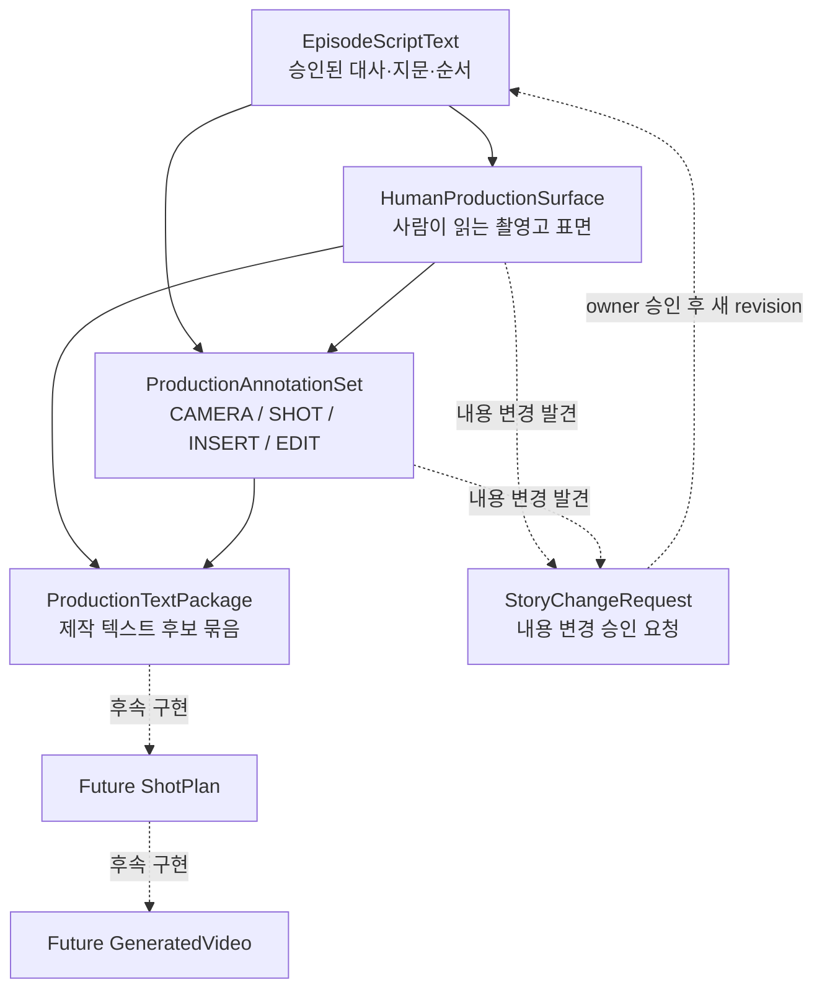

# Production text DAG

## 목적

대화가 작업 UI다. 사용자가 단계별로 확인하면 코어는 승인된 정확한 hash를
부모로 삼아 다음 artifact를 만든다. 터미널은 검증 수단이지 별도 운영 화면이
아니다.

## Gate

| Gate | 확인 대상 | 승인 역할 | 자동 통과 |
|---|---|---|---|
| P0 | 승인 대본과 사람 표면의 atom 단위 완전 동치 | system verifier 또는 owner | 검증만 가능, 승격은 아님 |
| P1 | 촬영 주석의 anchor, 의도, 필수 주석 담당 역할 | director/cinematographer/editor/producer/owner | 불가 |
| P2 | exact text/surface/annotation/P0/P1 hash 묶음 | producer 또는 owner | 불가 |
| 외부 전달 | exact production package | owner | 불가 |

## 무효화

대본 내용 hash가 바뀌면 그 아래 surface, annotations, receipts, package와 향후
shot/video가 모두 stale다. status나 승인 상태만 바뀌는 것은 내용 hash를
바꾸지 않는다. 그래프는 순환과 존재하지 않는 부모를 거절한다.

## 현재 1~3화 migration canary

- 잠금 원본 3개: byte hash를 읽어서 기존 고정값과 비교한다.
- v0.1~v0.5: 각 문서의 기준 촬영고 hash가 바로 전 파일 byte hash와 맞는지
  확인한다.
- 92개 대사 문구와 29개 장면 머리의 보존을 확인한다.
- v0.1~v0.2: P0 후보일 뿐 아직 equivalent 승인본이 아니다.
- v0.3~v0.4: 본문과 주석이 한 파일에 섞인 레거시 형식이라 canonical import
  전 분리해야 한다.
- v0.5: 휴대전화 전달·회수와 취식 순서가 바뀌므로 surface가 아니라
  `StoryChangeRequest` 레일이다.
- 원본/파생본 수정, 자동 승격, 외부 전달은 하지 않는다.
